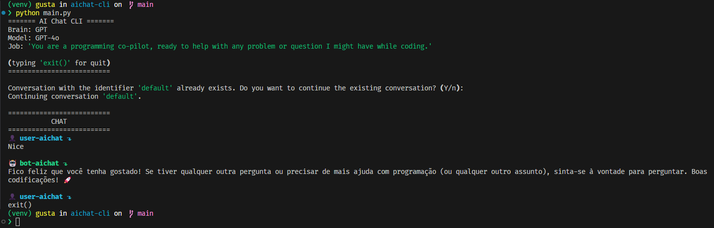

# AiChat CLI
AIChat-CLI is a user-friendly command-line interface (CLI) application built with Python that leverages the power of AI to provide intelligent conversational capabilities. This project aims to offer seamless integration with AI-driven chat functionalities, making it an ideal tool for developers and enthusiasts looking to interact with AI directly from their terminals, dispensing with the need for a graphical interface to function.
  
## Requirements
* Python 3.X
* Venv
* OpenAI API
  
## Features
- [x] OpenAI API
- [x] GPT-4o
- [x] Code Block
- [x] Markdown Text
- [x] Loading Prompt Wait
- [ ] Gemini API
- [ ] Prompt Stream Mod

## Issure
- [ ] Start prompt with "Enter" without text

## Download
### Git
```
git clone https://github.com/gustavofalcao1/AIChat-CLI.git
```
```
cd AIChat-CLI
```
### Auto-Install Linux
```
sudo chmod +x install.sh
```
```
sudo ./install.sh
```
### Auto-Uninstall Linux
```
sudo chmod +x uninstall.sh
```
```
sudo ./uninstall.sh
```
## Pre-exec
### Linux
```
sudo apt install -y python3.10 python3.10-venv python3-pip binutils
```
### Venv
```
  python -m venv venv
```
or
```
  python3 -m venv venv
```
### Windows:
```
venv\Scripts\activate
```
### Unix or macOS:
```
source venv/bin/activate
```
## Exec
### Dependences
```
pip install -r requirements.txt
```
### Setup
```
python setup.py install
```
or
```
python3 setup.py install
```
### Run
```
python main.py
```
or
```
python3 main.py
```
### Help
```
python main.py -h
```
or
```
python3 main.py -h
```
## Build
```
python build.py
```
or
```
python3 build.py
```
### Linux
```
sudo mv dist/aichat-cli /usr/local/bin/aichat
```

## Screenshots
<p align="center">
  
</p>
